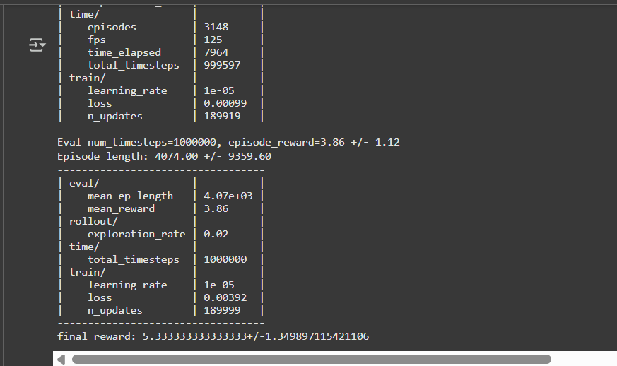
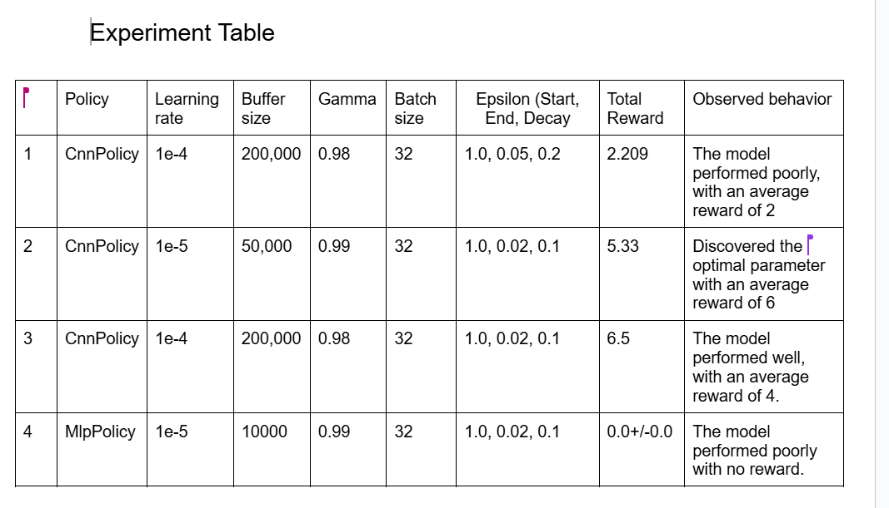
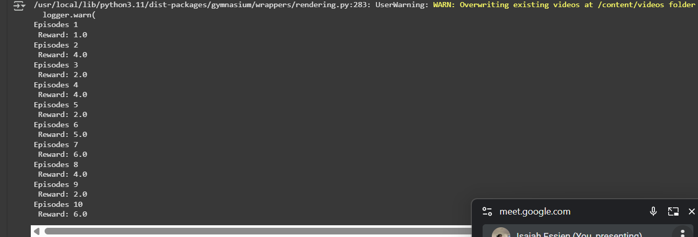

# Deep Q-Learning with Atari




This project implements a Deep Q-Network (DQN) Agent to play Atari games using Stable-Baselines3 and Gymnasium. The agent is trained using reinforcement learning and tested by playing multiple episodes, with gameplay videos automatically recorded and merged.


## Important Links

1. Link to Document Report: (Read the report)[https://docs.google.com/document/d/1Zi31nB2phCdlBAe-71EXWRT3vDTNPc1vG1QWQffsUVc/edit?usp=sharing]
1. Link to Video Recording: (Watch the game played live)[https://drive.google.com/file/d/17qgu97kS4u0JMkmQ9_nCD3hM_wGcs31f/view?usp=sharing]
1. Link to the CnnPolicy model: (Download and use our model)[https://drive.google.com/file/d/1vnySR5izAx4rLfIomgZ6dWA7wxPsb0Yq/view?usp=sharing]
---

## Project Overview
- Train a DQN Agent to play Breakout-v5 (or other Atari games).
- Save and load the trained model for future inference.
- Record gameplay videos and automatically merge them into a single video.
- Use different policies (`CnnPolicy`, `MlpPolicy`, etc.) based on the observation space.

---

## Installation
### Install Dependencies
Before running the project, install the required packages:

```sh
pip install stable-baselines3[extra]
pip install gymnasium[atari]
pip install gymnasium[accept-rom-license]
pip install ale-py
pip install opencv-python
```

## Folder structure 
│── DQN_agent_formative_group2.ipynb  # Jupyter Notebook for training & testing
│── train.py                           # Script to train the DQN agent
│── play.py                            # Script to load and test the trained model
│── README.md                          # Project documentation


## Training the model
- Run `python train.py`
Key Parameters in train.
py
Environment: ALE/Breakout-v5

Policy: CnnPolicy (for image-based input)

Learning Rate: 1e-5

Buffer Size: 50,000 (optimized to prevent memory overflow)

Exploration Strategy: ε-greedy with decay from 1.0 to 0.02

Total Training Steps: 1,000,000

Save Model: dqn_agent_breakout_final.zip

## Experiments


This table shows the number of experiments we tried. We had no computational resources to try more experiments, but these few helped us understand the relationship between the parameters, hyperparameters and the agent's behaviour. 
Futher evlauations and thourough report can be found in the document report. Link attched above 

## Playing thw game

Automatic Video Recording
The script records all episodes played by the model.

After playing, the videos are automatically merged into videos/final_video.mp4.



## Authors
1. Isaiah Essien
2. Ken Ganza
3. Caroline Gyireh